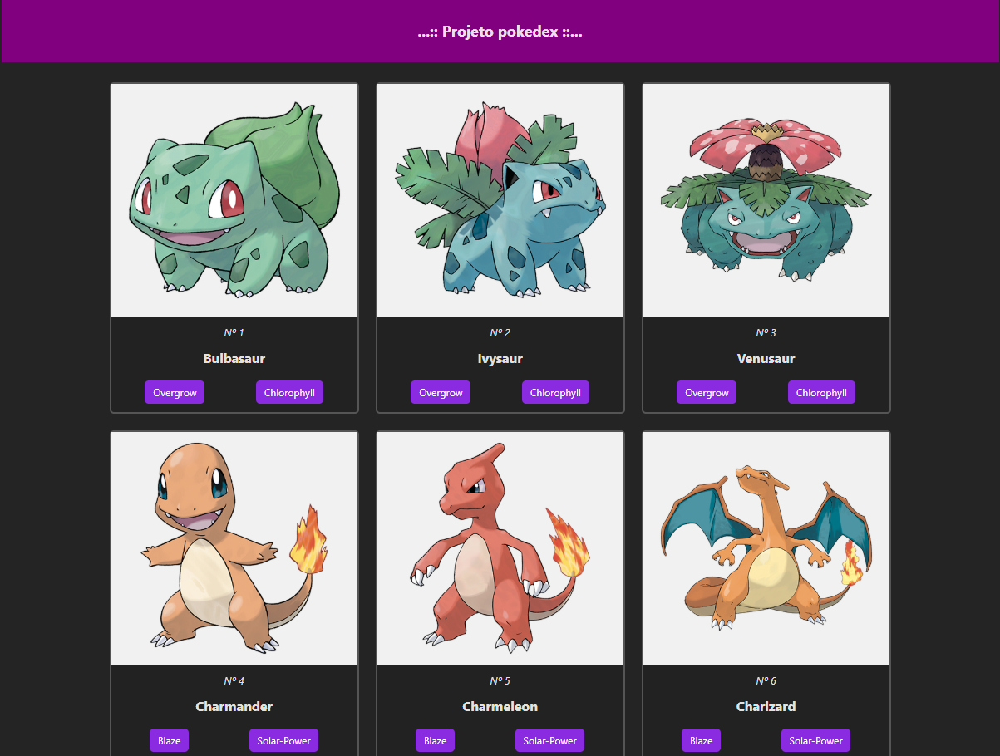

# 📱 App Project Pokedex

Um app simples criado com Vue.js e Vite, que consome a PokéAPI e exibe uma lista com 20 Pokémon. Cada card mostra o ID, nome e até 2 habilidades principais do Pokémon.

## 📸 Preview



## 🚀 Funcionalidades

- 📦 Consumo da PokéAPI
- 🧩 Renderização de 20 Pokémon em um grid
- 💡 Cards com:
  - ID
  - Nome
  - Até 2 habilidades principais

## 🛠️ Tecnologias Utilizadas

- [Vue.js](https://vuejs.org/)
- [Vite](https://vitejs.dev/)
- [Pinia](https://pinia.vuejs.org/) (gerenciamento de estado)
- [PokéAPI](https://pokeapi.co/) (dados dos Pokémon)

## ▶️ Como rodar o projeto

```bash
# Clone o repositório
git clone https://github.com/DevCled85/App_ProjectPokedex.git

# Acesse a pasta
cd App_ProjectPokedex

# Instale as dependências
npm install

# Inicie o projeto
npm run dev
